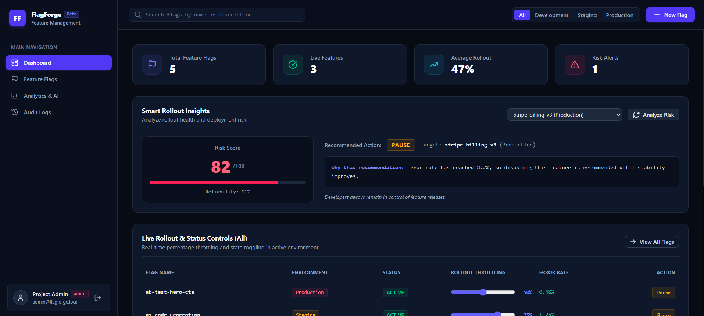

<div align="center">

# FlagForge - AI-Powered Feature Flag Management Platform


Manage feature releases across **Development**, **Staging**, and **Production** using centralized feature flags, AI-assisted rollout recommendations, secure authentication, and complete audit visibility.



<p>
  <strong>React • Vite • Express • MySQL • JWT</strong>
</p>

</div>

---

## Overview

Feature releases shouldn't require redeploying an application every time a feature needs to be enabled or disabled.

**FlagForge** is a full-stack feature flag management platform that allows developers to control feature availability through a centralized dashboard. It provides environment-specific feature management, AI-assisted rollout recommendations, secure role-based authentication, and a complete audit trail of configuration changes.

---

## Features

<table>
<tr>
<td width="50%">

### Feature Management

- Create, edit, and delete feature flags
- Pause or activate features instantly
- Configure rollout percentages
- Manage feature lifecycle from one dashboard

</td>
<td width="50%">

### Environment Control

- Development
- Staging
- Production
- Environment-specific feature visibility

</td>
</tr>

<tr>
<td>

### AI Rollout Insights

- Risk score evaluation
- Rollout recommendations
- Environment-aware analysis
- Human-controlled decisions

</td>
<td>

### Security & Visibility

- JWT Authentication
- Admin, Developer & Viewer roles
- Complete audit logs
- Permission-based access

</td>
</tr>
</table>

---

## Dashboard Preview

A centralized dashboard for monitoring feature rollouts, switching environments, reviewing AI recommendations, and tracking rollout activity.


---

## Technology Stack

| Layer | Technology |
|--------|------------|
| Frontend | React + Vite |
| Backend | Node.js + Express |
| Database | MySQL |
| Authentication | JWT |
| Styling | Tailwind CSS |
| Communication | REST APIs |

---

## Architecture

```text
                React + Vite
                     │
                 REST API
                     │
                     ▼
              Express Backend
                     │
      ┌──────────────┼──────────────┐
      ▼              ▼              ▼
 Feature Flags   Authentication  Audit Logs
                     │
                     ▼
                 MySQL Database
```

---

## Project Structure

```text
FlagForge/
├── backend/
│   ├── controllers/
│   ├── middleware/
│   ├── models/
│   ├── routes/
│   ├── services/
│   ├── app.js
│   └── server.js
│
├── database/
│   ├── schema.sql
│   └── seed.sql
│
├── frontend/
│   └── src/
│       ├── components/
│       ├── context/
│       ├── pages/
│       ├── services/
│       └── ...
│
├── dashboard-preview.png
├── package.json
├── vite.config.js
└── README.md
```

---

## Getting Started

### Clone the repository

```bash
git clone https://github.com/mishthhiiii/FlagForge.git
cd FlagForge
```

### Install dependencies

```bash
npm install
```

### Configure environment

Create a `.env` file using `.env.example` and configure the required MySQL connection details.

### Start the application

```bash
npm run dev
```

Open:

```text
http://localhost:3000
```

Health endpoint:

```text
http://localhost:3000/health
```

---

## Demo Accounts

| Role | Email |
|------|-------|
| Admin | `admin@flagforge.local` |
| Developer | `developer@flagforge.local` |
| Viewer | `viewer@flagforge.local` |

> Demo credentials are available from the login page.

---

## How FlagForge Works

1. A user signs in using JWT authentication.
2. The dashboard displays feature flags for the selected environment.
3. Developers create or update feature configurations.
4. AI Rollout Insights provide recommendation-based guidance.
5. Every important action is recorded in the audit log.
6. Feature availability changes without requiring a new deployment.

---

## REST API

FlagForge uses REST APIs to connect the React frontend with the Express backend for:

- User authentication
- Feature flag management
- Environment-based configuration
- Audit log retrieval
- Health monitoring

---

## Future Enhancements

- Scheduled feature releases
- Gradual percentage-based rollouts
- Team workspaces
- Webhook integrations
- Additional rollout analytics

---

<div align="center">

### Made with ❤️ by Mishthi Chaurasia

</div>
