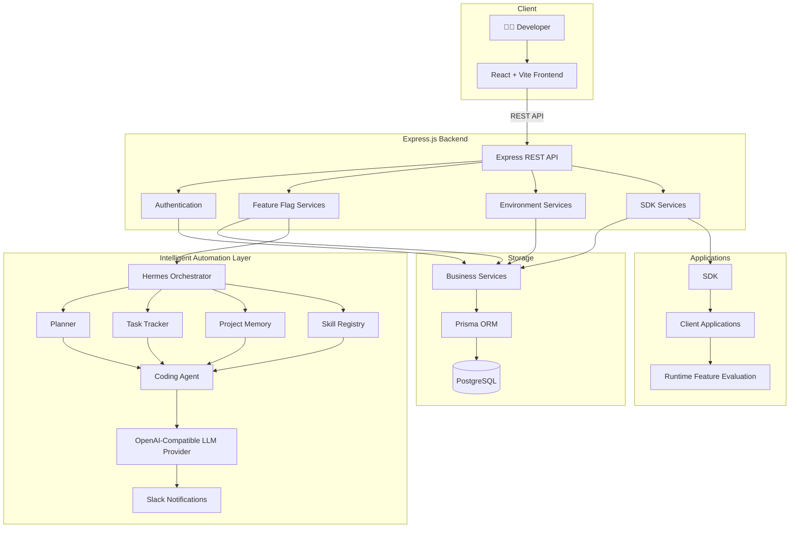

<div align="center">

## FlagForge

### AI-Powered Feature Flag Management Platform

FlagForge is an AI-powered feature flag management platform that enables engineering teams to ship software safely through real-time feature flags, intelligent deployment workflows, and environment-aware configurations. By combining centralized feature management with AI-driven automation, FlagForge empowers teams to release faster, minimize deployment risks, and maintain complete control over feature rollouts without requiring application redeployment.

<br>

<p align="center">


</p>

<br>


<br>

## 🚀 Live Demo

https://flag-forge-two.vercel.app/

</div>

---

# ✨ Features

## 🚀 Feature Flag Management

- Create, update, archive, and manage feature flags
- Enable or disable features instantly without application redeployment
- Centralized dashboard for feature management
- Dynamic feature evaluation
- Runtime configuration updates

---

## 🌍 Environment Management

- Development
- Staging
- Production

Maintain independent feature configurations across multiple environments for safer deployments.

---

## 🤖 AI-Powered Automation

- AI-assisted deployment workflows
- Hermes-powered orchestration
- Intelligent rollout planning
- Automated release coordination
- Context-aware project memory
- Slack-powered deployment notifications

---

## 📊 Analytics & Monitoring

- Feature rollout monitoring
- Environment insights
- Deployment analytics
- Usage statistics
- Feature lifecycle tracking

---

## 🔒 Authentication & Security

- JWT Authentication
- Protected API routes
- Secure session management
- Scalable authentication architecture

---

## 🔌 SDK Support

- SDK endpoints for client applications
- Runtime feature evaluation
- Centralized feature delivery
- Lightweight integration for external applications

---

## ⚙️ Developer Experience

- RESTful APIs
- Modular architecture
- TypeScript throughout the stack
- Prisma ORM integration
- Scalable service-oriented backend
- Developer-friendly workflow

---

# 🏗️ High-Level Architecture

FlagForge adopts a modular, service-oriented architecture that separates feature management, intelligent automation, and deployment workflows into independent layers. This design improves scalability, maintainability, and enables AI-assisted release management.



---

# 🛠 Tech Stack

| Category | Technologies |
|-----------|--------------|
| **Frontend** | React • TypeScript • Vite • Tailwind CSS |
| **Backend** | Node.js • Express.js • TypeScript |
| **Database** | PostgreSQL • Prisma ORM |
| **Authentication** | JWT |
| **Intelligent Automation** | Hermes Orchestrator • Planner • Task Tracker • Coding Agent • Project Memory • Skill Registry • OpenAI-Compatible LLM Provider |
| **Integrations** | Slack • SDK |
| **Development Tools** | Git • GitHub • Cursor |

---

# 📂 Project Structure

```text
FlagForge/
│
├── frontend/
│   ├── public/
│   ├── src/
│   │   ├── components/
│   │   ├── context/
│   │   ├── hooks/
│   │   ├── pages/
│   │   ├── services/
│   │   ├── types/
│   │   ├── utils/
│   │   ├── App.tsx
│   │   └── main.tsx
│   │
│   ├── package.json
│   └── vite.config.ts
│
├── backend/
│   ├── prisma/
│   ├── src/
│   │   ├── agents/
│   │   │   ├── coding-agent/
│   │   │   ├── orchestrator/
│   │   │   └── shared/
│   │   │
│   │   ├── communication/
│   │   │   └── slack/
│   │   │
│   │   ├── controllers/
│   │   ├── memory/
│   │   ├── middleware/
│   │   ├── routes/
│   │   ├── sdk/
│   │   ├── services/
│   │   ├── types/
│   │   ├── utils/
│   │   └── server.ts
│   │
│   ├── package.json
│   └── tsconfig.json
│
├── docs/
│   ├── architecture.md
│   ├── agent-log.md
│   └── project-memory/
│
├── preview.png
├── README.md
└── LICENSE
```

---

# ⚙️ Installation

## Prerequisites

Before getting started, ensure you have the following installed:

- Node.js (v18 or later)
- npm or yarn
- PostgreSQL
- Git

---

## Clone the Repository

```bash
git clone https://github.com/mishthhiiii/FlagForge.git
```

```bash
cd FlagForge
```

---

## Backend Setup

Navigate to the backend directory:

```bash
cd backend
```

Install dependencies:

```bash
npm install
```

Create a `.env` file and configure the required environment variables.

```env
DATABASE_URL=your_database_url

JWT_SECRET=your_jwt_secret

OPENAI_API_KEY=your_openai_api_key

SLACK_WEBHOOK_URL=your_slack_webhook_url
```

Start the backend server:

```bash
npm run dev
```

---

## Frontend Setup

Open another terminal.

```bash
cd frontend
```

Install dependencies:

```bash
npm install
```

Start the development server:

```bash
npm run dev
```

The application will be available at:

```text
Frontend: http://localhost:5173

Backend: http://localhost:5000
```

---

# 🤝 Contributing

Contributions are always welcome!

If you'd like to improve FlagForge, follow these steps:

1. Fork the repository.
2. Create a new feature branch.

```bash
git checkout -b feature/your-feature
```

3. Commit your changes.

```bash
git commit -m "Add your feature"
```

4. Push to your branch.

```bash
git push origin feature/your-feature
```

5. Open a Pull Request.

Please ensure your contributions follow the existing project structure, coding standards, and include relevant documentation where applicable.

---


<div align="center">

# 👩‍💻 Developed By

### **Mishthi Chaurasia**


</div>
